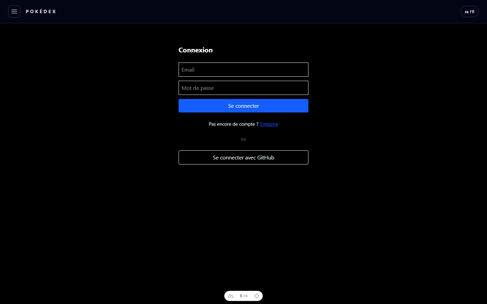
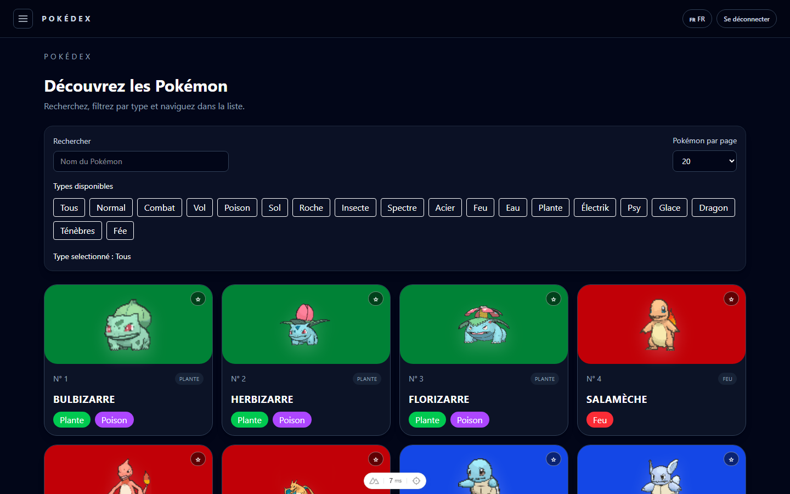
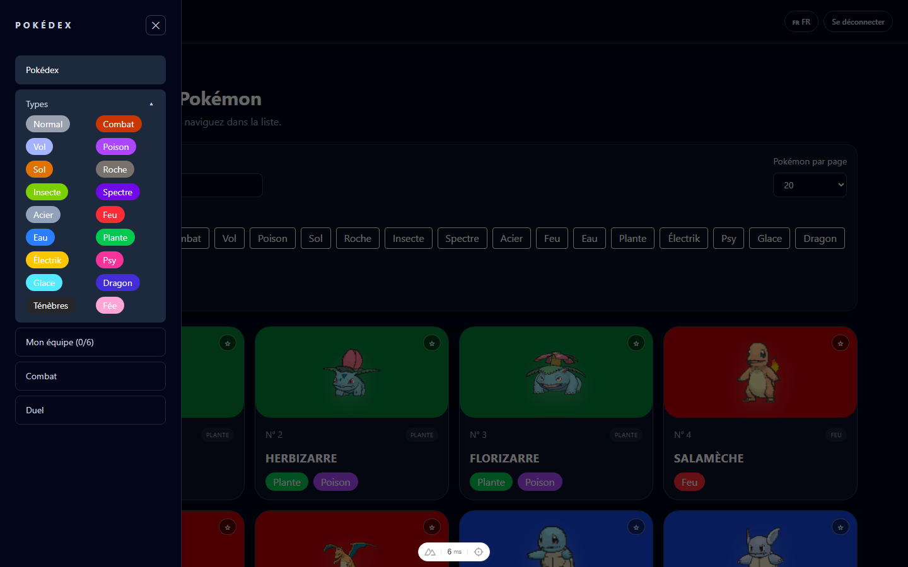
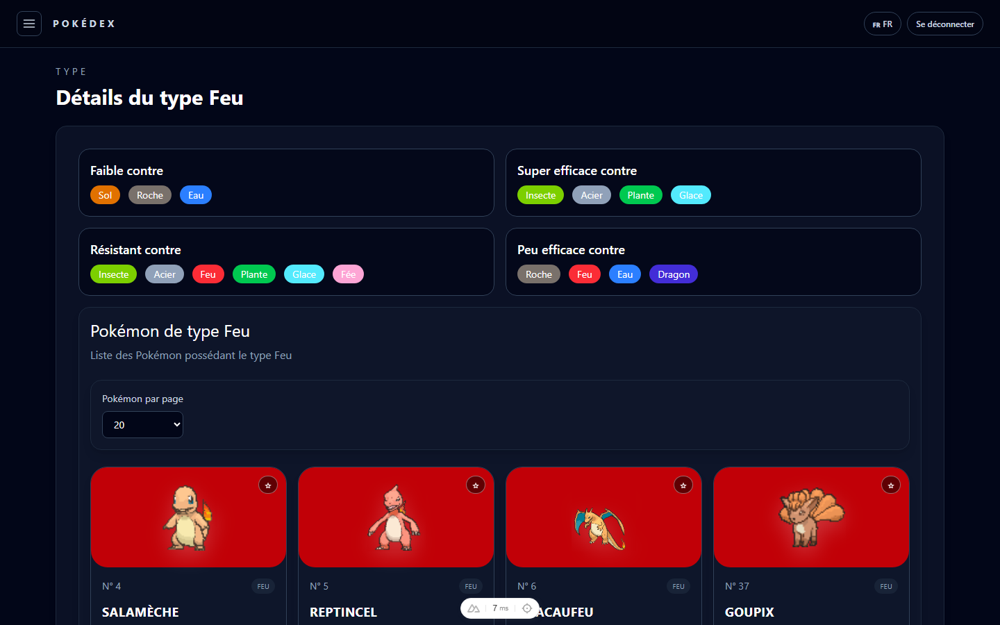
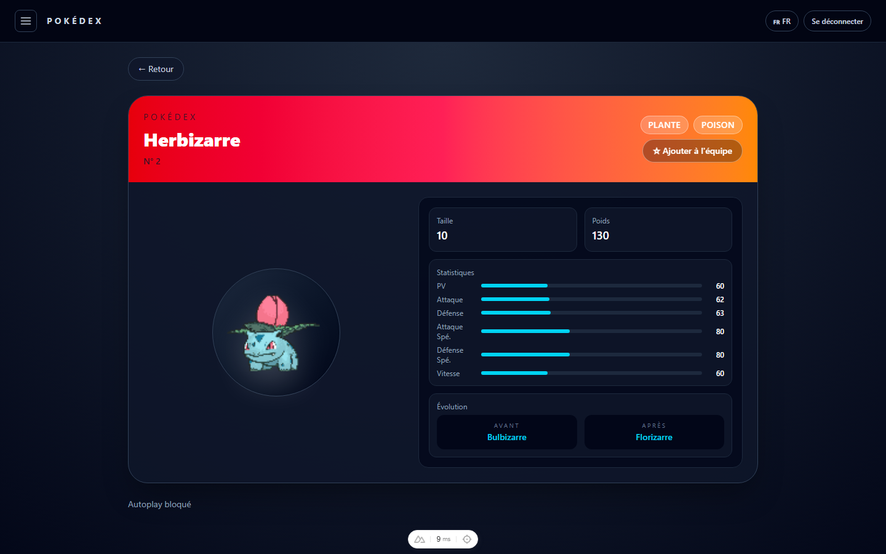
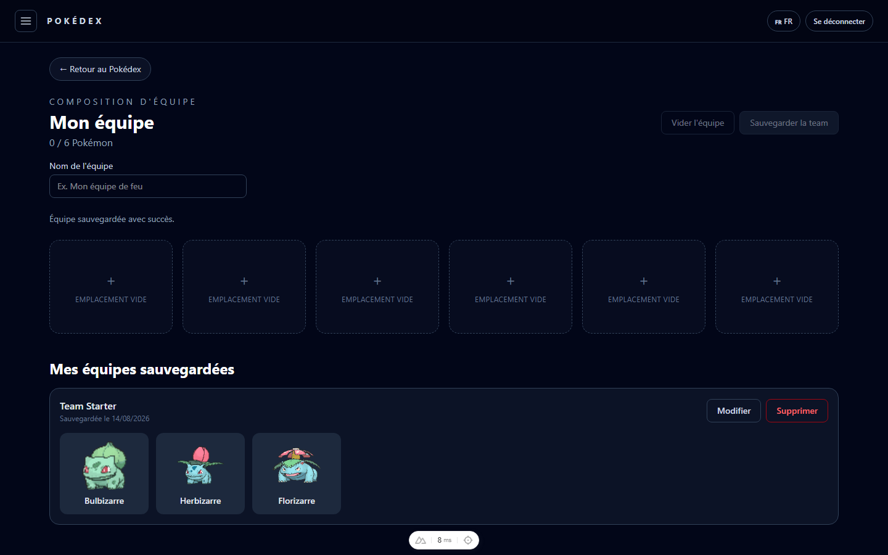
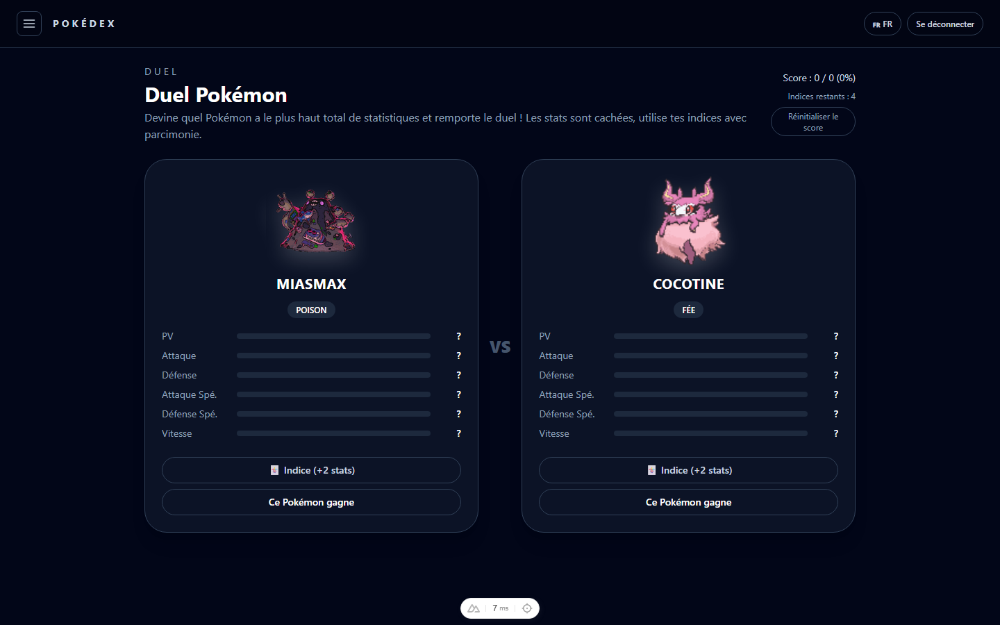
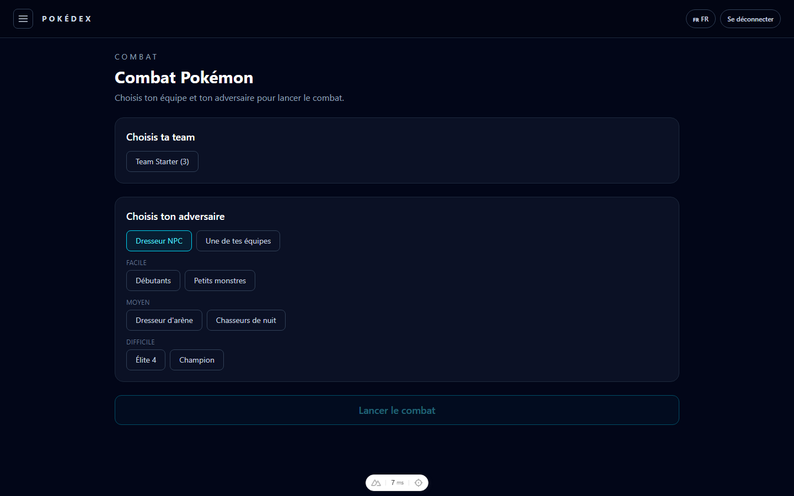
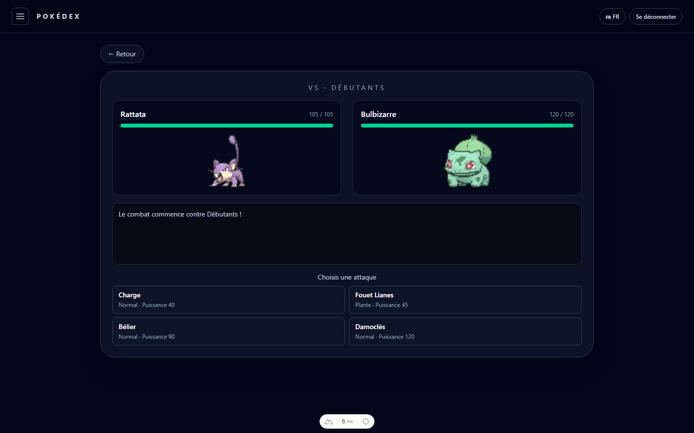

# Pokédex — Nuxt 4 / Vue 3 / Prisma

Une application Pokédex complète construite avec Nuxt 4, Vue 3, Pinia et Prisma (PostgreSQL) : recherche et filtrage des Pokémon, composition d'équipes, jeu de duel de statistiques, et un vrai système de combat au tour par tour contre des dresseurs IA ou vos propres équipes.

Projet réalisé dans le cadre d'un TP Vue.js / Nuxt.js (ESGI).

## Sommaire

- [Fonctionnalités](#fonctionnalités)
- [Captures d'écran](#captures-décran)
- [Stack technique](#stack-technique)
- [Installation](#installation)
- [Scripts disponibles](#scripts-disponibles)
- [Structure du projet](#structure-du-projet)
- [Limites et améliorations possibles](#limites-et-améliorations-possibles)

## Fonctionnalités

### Authentification
- Inscription / connexion par email + mot de passe (hash bcrypt).
- Connexion via GitHub OAuth (`nuxt-oidc-auth`).
- Toutes les routes API (`/api/*`, hors `/api/auth/*`) sont protégées par un middleware global ; toutes les pages nécessitent une session active.
- Déconnexion depuis la barre de navigation.

### Pokédex
- Liste paginée des Pokémon avec recherche par nom et filtre par type.
- Fiche détail d'un Pokémon : sprite animé, taille, poids, statistiques de base, cri audio, et évolutions (avant/après) — noms traduits en français.
- Traduction FR/EN à la volée sur l'ensemble de l'interface (noms de Pokémon, types, textes).

### Types
- Panneau latéral listant les 18 types, avec navigation directe vers la fiche d'un type.
- Fiche détail d'un type : faiblesses, résistances, immunités et super-efficacités, ainsi que la liste paginée des Pokémon de ce type.

### Équipes
- Composition d'une équipe de 6 Pokémon maximum.
- Sauvegarde, modification et suppression d'équipes, liées au compte de l'utilisateur connecté (chaque utilisateur ne voit que ses propres équipes).

### Duel (mini-jeu)
- Deux Pokémon aléatoires s'affrontent sur la somme de leurs statistiques, cachées au départ.
- Système d'indices (jokers) pour révéler progressivement des statistiques avant de deviner le gagnant.
- Score cumulé sur la session.

### Combat au tour par tour
- Sélection d'une de vos équipes sauvegardées, puis d'un adversaire : équipe NPC (3 niveaux de difficulté) ou une autre de vos équipes.
- Moteur de combat maison : formule de dégâts niveau 50, bonus STAB, grille d'efficacité des types complète, ordre des actions basé sur la vitesse, IA simple côté NPC.
- Interface de combat avec barres de PV, choix d'attaque, changement de Pokémon et journal de combat en temps réel.

## Captures d'écran

| Connexion | Pokédex |
|---|---|
|  |  |

| Navigation par types | Détails d'un type |
|---|---|
|  |  |

| Fiche Pokémon | Composition d'équipe |
|---|---|
|  |  |

| Duel | Mise en place d'un combat |
|---|---|
|  |  |

| Combat en cours |
|---|
|  |

## Stack technique

- [Nuxt 4](https://nuxt.com/) / [Vue 3](https://vuejs.org/) (Composition API, `<script setup>`)
- [Pinia](https://pinia.vuejs.org/) pour la gestion d'état (équipes, combat, duel, locale — persistés en `localStorage`)
- [Prisma ORM](https://www.prisma.io/) + PostgreSQL
- [Tailwind CSS v4](https://tailwindcss.com/)
- [nuxt-oidc-auth](https://github.com/npm-oidc-auth) pour l'authentification GitHub OAuth
- [PokéAPI](https://pokeapi.co/) comme source de données Pokémon (importée en base via des scripts)

## Installation

### Prérequis
- Node.js 20+
- Un serveur PostgreSQL accessible (ou Docker)

### 1. Cloner et installer les dépendances

```bash
git clone <url-du-repo>
cd projetFinaleVueJsNuxtJs
npm install
```

### 2. Lancer une base PostgreSQL locale (via Docker)

```bash
docker run --name pokemon-postgres -e POSTGRES_USER=pokemon -e POSTGRES_PASSWORD=pokemon -e POSTGRES_DB=pokemon -p 5432:5432 -d postgres:16-alpine
```

### 3. Configurer les variables d'environnement

```bash
cp .env.example .env
```

Complétez `.env` :
- `DATABASE_URL` : déjà pré-rempli pour correspondre à la commande Docker ci-dessus.
- `NUXT_OIDC_SESSION_SECRET` et `NUXT_OIDC_AUTH_SESSION_SECRET` : générez deux chaînes aléatoires, par exemple avec `openssl rand -hex 32`.
- `CLIENT_ID` / `CLIENT_SECRET` : créez une [GitHub OAuth App](https://github.com/settings/developers) avec comme callback URL `http://localhost:3000/auth/github/callback` (uniquement nécessaire pour tester la connexion GitHub — l'authentification par email/mot de passe fonctionne sans).

### 4. Appliquer les migrations et générer le client Prisma

```bash
npx prisma migrate deploy
npx prisma generate
```

### 5. Importer les données Pokémon

```bash
npm run import:types
npm run import:pokemon
npm run seed:npc-teams
```

### 6. Lancer le serveur de développement

```bash
npm run dev
```

L'application est accessible sur [http://localhost:3000](http://localhost:3000).

## Scripts disponibles

| Commande | Description |
|---|---|
| `npm run dev` | Lance le serveur de développement |
| `npm run build` | Build de production |
| `npm run preview` | Prévisualise le build de production |
| `npm run generate` | Génère un build statique |
| `npm run import:types` | Importe les 18 types Pokémon en base |
| `npm run import:pokemon` | Importe les Pokémon (stats, sprites, cris, moves) depuis PokéAPI |
| `npm run seed:npc-teams` | Crée les équipes adverses (NPC) par niveau de difficulté |

## Structure du projet

```
app/
  components/    Composants Vue (cartes Pokémon, arène de combat, sidebar, ...)
  composables/   Logique réutilisable (auth, équipe, traduction, moteur de combat, ...)
  pages/         Routes de l'application (Pokédex, types, équipe, duel, combat, auth)
  stores/        Stores Pinia (équipe, combat, duel, locale, liste/pagination)
  plugins/       Hydratation client des stores persistés
  utils/         Couleurs de types, traductions, grille d'efficacité des types
server/
  api/           Endpoints REST (Pokémon, types, équipes, combat, auth)
  middleware/    Middleware d'authentification global
  utils/         Helpers serveur (Prisma, résolution de l'utilisateur courant)
prisma/          Schéma et migrations
scripts/         Scripts d'import/seed depuis PokéAPI
```

## Limites et améliorations possibles

- **Pas de sprites shiny** : seuls les sprites standards sont importés/affichés.
- **Combat simplifié** : ni objets tenus, ni capacités (talents), ni statuts (poison, paralysie, etc.) — seules les attaques offensives et l'efficacité des types sont prises en compte.
- **i18n maison** : la traduction FR/EN repose sur un composable interne plutôt que sur un module i18n standard (`@nuxtjs/i18n`), ce qui limite l'ajout facile de nouvelles langues.
- **Pas de récupération de mot de passe** ni de vérification d'email à l'inscription.
- **Un léger décalage SSR** peut apparaître sur la fiche Pokémon : le tout premier rendu serveur peut ne pas transmettre le cookie de session à un appel interne, ce qui affiche brièvement l'état de chargement avant que le contenu ne s'affiche correctement après hydratation côté client (comportement sans impact visible pour l'utilisateur).
- **Pas de tests automatisés** (unitaires ou end-to-end) dans le dépôt.
- **Déploiement** non documenté (pas de Dockerfile applicatif ni de configuration CI/CD).
